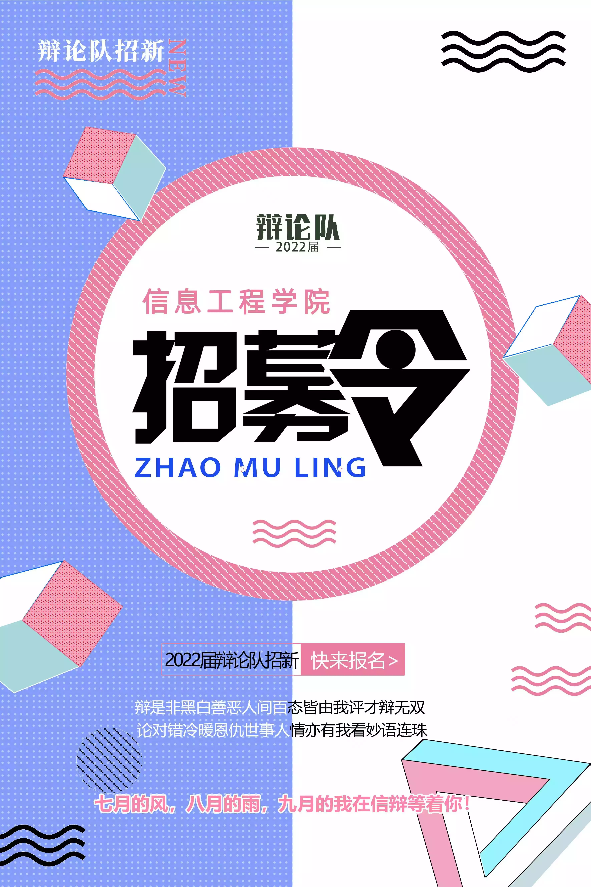
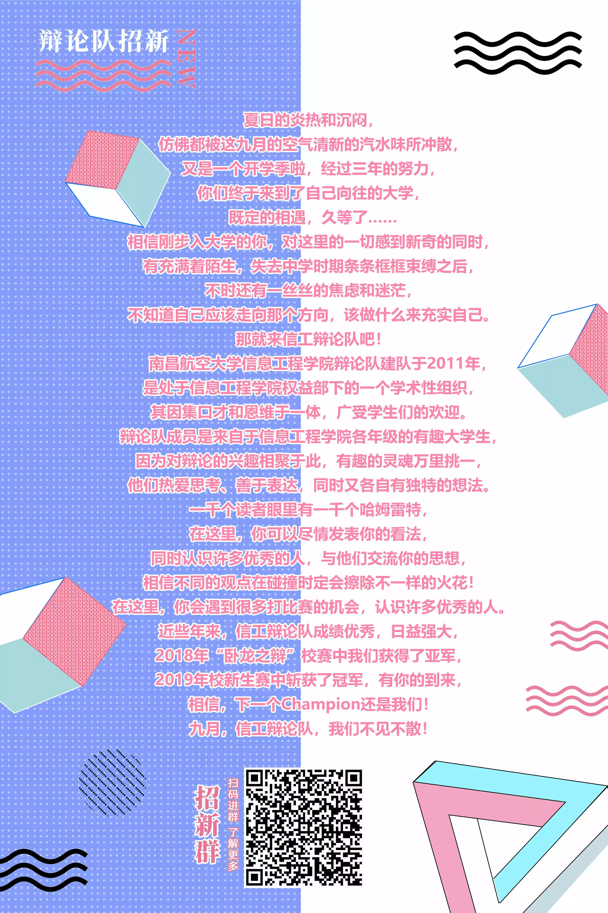

 

谨代表信息工程学院辩论队问候各位！

### 对我来说的一段独一无二并且难忘的经历

一年来，打了那么多辩题，大家都付出了很多成长了很多，回过头来看，其实辩论的输赢是没有那么重要的，大家一起思考讨论辩题，大家都尽力了，开心了，一起奋斗过，那些时光才是最重要的。当然，还有不断成长的自己，或许有时候会觉得说很累，但是最后看是值得的，辩论带给我的成长与感动将伴随我终身。

很久以后想起这段独特的经历，或许我会是会心一笑吧，“我大学时也是辩论队的一员欸！”，那样美好的青春年华遇见辩论，我依然很庆幸大一上学期克服胆怯坚定不移的选择了辩论队，个人认为大学是我人生中离辩论最近的时候，抓住这个机会，如果感兴趣的话就冲吧！

<!-- more -->

## 我们是，信工辩论队

我们有辉煌的历史。
南昌航空大会信息工程学院辩论队建队于2011年，是处于信息工程学院权益部下的一个学术性组织。其因集口才和思维于一体，广受学生们的欢迎。

辩论队成员是来自于信息工程学院各年级的有趣大学生，因为对辩论的兴趣相聚于此，有趣的灵魂万里挑一，他们热爱思者，善于表达，同时又各自有独特的想法。

一千个读者眼里有一千个哈姆雷特，在这里，你可以尽情发表你的看法，同时认识很多优秀的人，与他们交流你的思想，相信不同的观点在碰撞时定会擦出不一样的火花！在这里，你会遇到很多打比赛的机会，认识许多优秀的人。

近些年来，信工辩论队成绩优秀，日益强大，2018年“卧龙之辩”校赛中我们获得了亚军，2019年校新生赛中斩获了冠军，有你的到来，相信，下一个Champion还是我们！

## 我们将一起

### 01 结交好朋友--这里有良好的氛围

信工辩论队可是一个大组织，各专业的学长学姐都涉及，不可不称之为一个大家庭，大家因为都喜欢辩论而聚集到一起。我们一起学习，一起交流辩论，学长学姐都是非常**友善**的哦，每次都和不一样的小伙伴组队，想要交朋友的不要错过啦！

当然辩论辩论，免不了会有争吵，但正是在争吵中我们对彼此更加熟悉啊，我们也变得更加包容学会倾听不同的观点之间感情也更加深厚，（~~也锻炼了一番吵架的能力是不是~~

而且，会有和其它学院的同学结交的机会，不同学院间约模辩，大家彼此请教互相学习共同进步。

### 02 准备比赛-----思维的碰撞与自己能力的提升

打辩论，打辩论，拿到一个辩题，思考标准定义论点逻辑都是必不可少的，可能听起来有些不知所措，但是准备比赛的过程不是孤身一人，大家包括学长学姐对辩题提出自己各异的想法和解读，这会是一场精彩的思维碰撞，我们学会聆听他人的观点，我们逐渐拥有非常强的从多个角度分析问题以及梳理各种观点的来龙去脉的能力。

并且，辩论涉及题目广泛，从社会学、哲学、政治，到人权、科学、和国际关系，通过不同的辩论话题，同学们可以拓宽视野，增加知识量。

### 03 上场--紧张刺激的模辩和比赛与自己能力的证明

在辩论队，打辩论的机会绝对不会少，不用担心你的才华得不到施展，每次比赛都会设有正赛组和模辩组，可以队内打，也经常和其它学院比如文法外院的同学们一起开展模辩。

每次真正上场都是一次宝贵的经验，在经过了充足的准备后站上赛场！去大胆自信的说出自己的观点吧，这也是一个建立自信的好机会，不必害怕，平常与你讨论得唇枪舌剑的队友就在你的身旁，那是展示你们思考成果的时刻。

每次对局也设有最佳辩手，那将会是你实力的证明！

### 04 玩乐--欢快的团建

打完了比赛当然要好好的庆祝一番了！
在后山一点打牌到十点是可以说的吗QwQ

## 最后，信息工程学院辩论队欢迎你的到来！

**相信从你心动的那一刻起，故事就已经开始了！** 

不要犹豫，喜欢就去做！

大家一起谱写新的故事篇章吧！信息工程学院辩论队欢迎你成为我们的一员！