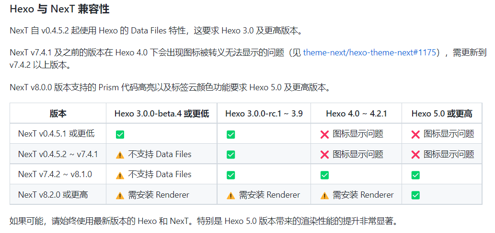
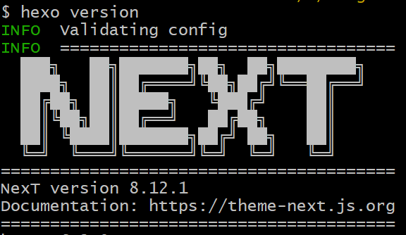
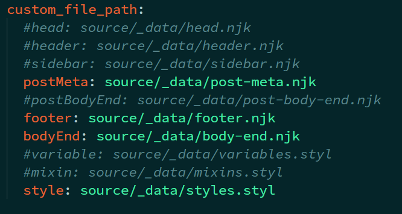

之前安装next主题的时候居然没有安装最新版？？？！
网上找了一遍发现next有三个仓库



很多新功能也只有next最新版本才支持，但是我已经在7.8版本的next配置文件下修改了好多内容，如果更新会全部被覆盖！啊，亡羊补牢为时不晚，我开始了我的更新之路。
<!--more-->
可以的话还是查看 *[官方文档](https://github.com/next-theme/hexo-theme-next/issues/4)* 辅助升级，这样对很多细节都能了解的比较清楚~~还可以提高英文阅读水平~~

## 下载更新
由于我更新前使用的是7.8.0版本，直接通过npm下载更新即可
> NexT 支持在不修改主题仓库内文件的情况下进行配置和自定义，因此无论是使用 Git 还是 npm 都能顺利更新。如果你见到要求直接修改主题文件的「教程」文章，请谨慎甄别，因为其内容可能过时。
```bash
npm install hexo-theme-next
```
通过 `npm` 安装的 Next 主题默认文件夹路径为 `hexo-site/node_modules/hexo-theme-next` 。然后去把那个文件夹重命名为next移到之前博客themes目录下即可。
> 这里我采取的操作是把把旧的next文件夹命名为next-V7，旧的文件夹因为有我之前配置好的文件，所以不能直接删除。

更名完成后再运行`hexo version`出现下方界面，说明成功更新为next最新版本。


## 迁移配置文件
官方文档是这么说的，鼓励用户使用自定义文件来配置，以防更新的时候被直接覆盖，取消注释主题配置文件中 custom_file_path 部分下对应的内容（注意文件名与路径要一致），即可完成对于主题的自定义。
> It is not recommended to directly modify any files in the NexT theme. Because this may cause errors (e.g. merge conflicts), and the modified files may be discarded when upgrading the theme.
>
> At present, NexT encourages users to use the Alternate Theme Config to configure NexT. And it's easy to customize the layout or style of NexT using Custom Files.

我在之前使用 Next V7 版本的时候，就已经把主题配置放置在站点的 source/_data/next.yml 文件中，本来升级的时候还以为这个文件那就不用改了直接移过去。
一调试，GG，not support不被支持。
查看了一下官方文档说是其已经完成历史使命将在V8.1.0版本后停止支持，现在推荐的做法是创建并配置 _config.next.yml 文件，需要 Hexo 版本在 5.0 及以上。

### 创建并配置 _config.next.yml 文件

直接在hexo博客目录下新建 `_config.next.yml` 文件即可，将新的next文件下_config.yml 里面的内容全部复制过去，然后我是用使用了 Beyond Compare 软件把`_config.next.yml` 和旧主题配置文件 `source/_data/next.yml` 两者进行文本比较，根据自己的需求迁移整合相关配置项。之后检查一堆新功能设置半天可算是成功配置好了！

## 迁移 Favicon 位置
之前我博客的 Favicon 图片都是放在 ./themes/next/source/images 目录下面，正好趁着这次升级的机会，将图片全部移到了 `hexo-site/source/images` 下（没有这个文件夹则自己新建即可），这样以后更新的时候就不需要担心被覆盖图标找不到了的问题了。

之后可以检查一下 _config.next.yml 文件下关于 Favcion 设置地址有无错误。

## 自定义配置迁移



> 值得注意的是Hexo 5.0 版本移除了对于 swig 模版的支持，使用 Nunjucks 代替 swig 作为模版引擎，主题配置文件内 custom_file_path 支持文件的后缀也从 .swig 变成了 .njk。所以如果此前根据 swig 的语法写过自定义内容，请在更新前确认它们是与 Nunjucks 兼容的，否则会报错，且生成的页面为空白。例如， Nunjucks 只支持 and 运算符，需要替换掉 swig 中的 &&。

然后把需要的文件一一转移过去即可，和之前配置_config文档一样，上述文件把需要替换的取消注释然后在相应位置创建相应文件即可。

## 总结
前前后后大概总共折腾了7个小时吧完成了这次更新，虽然网站页面布局并没有太大变动，但是这次把配置文件一次性全部迁移到博客目录下，采取的是覆盖而非修改主题本身配置，以后更新的时候就不用这么麻烦了~~也算是一种一劳永逸？~~