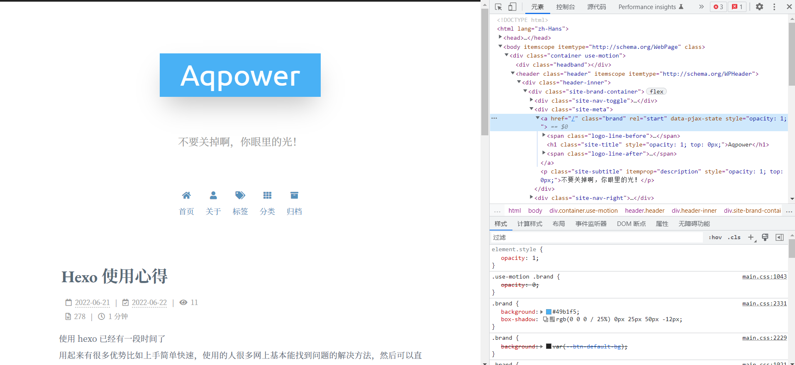

使用 hexo 已经有一段时间了
用起来有很多优势比如上手简单快速，使用的人很多网上基本能找到问题的解决方法，然后可以直接挂在 GitHub Page上面，不需要服务器也不需要域名就可以快速的建立一个自己的网站
劣势的话诸如因为是静态网站所以要自己实时上传发布，不能随时随地发表文章等等
此文用来记载平时的一些小技巧
<!--more-->
- [自定义CSS](#自定义css)
- [新建page后自动弹出编辑窗口（懒人必备](#新建page后自动弹出编辑窗口懒人必备)
- [Hexo 实现文章加密](#hexo-实现文章加密)

**以下全部基于Next7.8主题**
关于主题美化的技巧就不说太多了网上有很多教程**值得注意的是不同版本的主题操作是不一样的！**
这里贴几个链接
*[官方教程](https://theme-next.js.org/docs/theme-settings/miscellaneous.html#GitHub-Banner)*
*[基于Hexo搭建个人博客——进阶篇(从入门到入土)](https://yangbingdong.com/2017/build-blog-hexo-advanced/)*
*[hexo+next建站_基础](https://www.crane0.com/2020/04/14/hexo+next%E5%BB%BA%E7%AB%99_%E5%9F%BA%E7%A1%80/)*
*[Hexo踩坑_主题优化](http://haoran.tech/2018/08/21/Hexo%E8%B8%A9%E5%9D%91-%E4%B8%BB%E9%A2%98%E4%BC%98%E5%8C%96/)*

### 自定义CSS
需要有一点CSS基础，很基础的就行


1. 打开网站 F12 或者右键检查我们都能够看到的如图所示界面，next主题允许我们自己自定义css文件覆盖主题本省的style
2. 打开 themes 目录下的 _config 文件，修改下方配置，把需要修改的 style 取消注释即可，再在相应目录下创建相应文件（是你的博客所在的目录），即可实现覆盖效果。
常见的要修改的比如 fontsize color padding margin 等等，加阴影也可以在此实现，好好了解一下CSS 也不错。
```
custom_file_path:
  #head: source/_data/head.swig
  #header: source/_data/header.swig
  #sidebar: source/_data/sidebar.swig
  #postMeta: source/_data/post-meta.swig
  #postBodyEnd: source/_data/post-body-end.swig
  #footer: source/_data/footer.swig
  # bodyEnd: source/_data/body-end.swig
  #variable: source/_data/variables.styl
  #mixin: source/_data/mixins.styl
  #style: source/_data/styles.styl
```
3. 再次部署  `hexo s && hexo g -d` 即可。

### 新建page后自动弹出编辑窗口（懒人必备
每次在 `hexo new page 'test'` 后必须再去 posts 文件夹中打开编辑，其实还是有点麻烦？~~(我没有那么懒的但是属实是方便)~~
自动弹出方法如下：
1. 打开博客目录下 scripts 文件夹（如果没有则新建），新建 opaction.js 文件，内容如下
```javascript
var spawn = require('child_process').exec;

hexo.on('new', function(data){
  spawn('start  "C:\Program Files\Typora\Typora.exe" ' + data.path);
});
```
将路径修改为自己 markdown 文件编辑器的绝对路径即可
2. 再次部署发现成功在 new 一篇文章后自动打开编辑器进入编辑页面。以后又可以多节省一点时间了呢！

### Hexo 实现文章加密
虽然是自己的博客，但有时候果然还是会有想要加密的想法啊
有时候会有倒垃圾的情况，把情绪全部发泄在这里
网上查找了一番，是有一个插件可以实现这种情况的
[详细可见官方文档](https://github.com/D0n9X1n/hexo-blog-encrypt)
- 快速使用
   安装插件，然后在需要加密的文章信息头部如下方所示加入 password 即可，再次部署即可实现加密功能。
   `npm install --save hexo-blog-encrypt`
   or `yarn add hexo-blog-encrypt` (require [Yarn](https://yarnpkg.com/en/))
```markdown
---
title: Hello World
date: 2022-06-22 22:20:57
password: password
---
```

