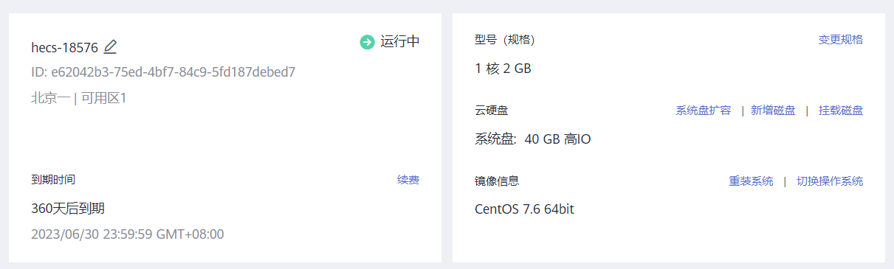
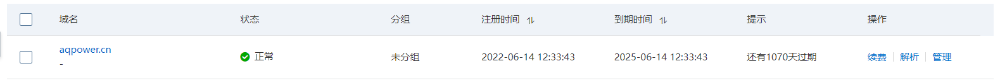
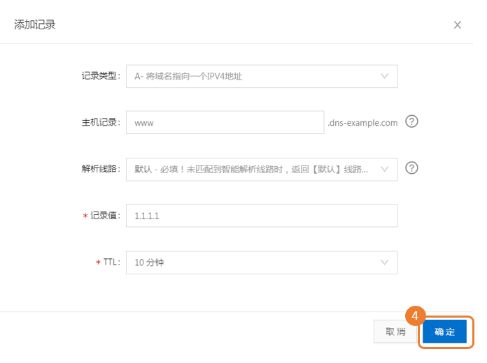
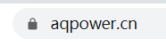
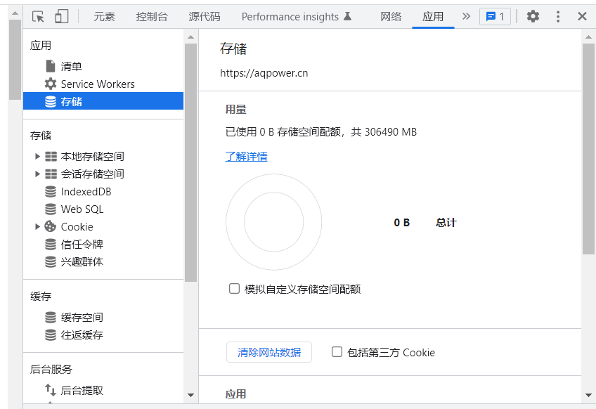

域名终于备案通过啦！好耶ヽ(✿ﾟ▽ﾟ)ノ
那么就趁着这个劲头再加上之前入手服务器，就一鼓作气把博客部署到自己的服务器上吧！
hexo是静态博客，然后之前的话是直接部署到GitHub Pages上面也确实方便快捷，但是访问太慢了，并且想折腾一下，还想整个个人服务器，就买了华为云的服务器，把Hexo搬过来了。
<!--more-->

## 大致思路
Nginx做静态文件服务器，实现外界对网站资源目录的访问
在服务器上搭建Git环境，创建Git仓库
在主机生成Hexo静态文件，通过与服务器连接，推到服务器上的Git仓库
通过git-hooks实现自动部署到网站资源目录

## 服务器环境搭建
首先是我的配置，我的服务器是华为云上的，系统是CenOS 7.6


### 使用yum安装nginx作为我们的服务器
（这一步CenOS 8.x 的系统可能会出现错误）
1.安装

```
yum -y install nginx
```
2.配置服务器路由
```
systemctl start nginx  #启动nginx
systemctl enable nginx  #设置开机启动
```

此时用公网ip去访问即可看到一个欢迎页面，欢迎页面可能是“Welcome to nginx ”也可能是“Welcome to centos”，欢迎页面的字样取决于 nginx 版本和下载方式的不同，只要能正常显示一个欢迎页面就好。
**那么我们现在希望的就是 nginx 指向我们自己的博客页面而不是默认页面**
更改nginx的配置


> 关于nginx的配置文件共两种情况：
1.首先是位于etc/nginx/conf.d/下的dafault.conf
2.其次是有些云服务器比如我的华为云配置文件是etc/nginx/ 下的 nginx.conf 。
3.我们也可用nginx -t命令查看我的配置文件所在

配置过程如下：
```
vi /etc/nginx/nginx.conf
#按a进入插入模式，修改完后ESC，:wq退出保存
include /etc/nginx/conf.d/*.conf;
    server {
        listen       80;
        listen       [::]:80;
        server_name  XXXX;#填云服务器的公网ip或者域名
        root         /home/www/website;#这里填博客目录存放的地址

        # Load configuration files for the default server block.
        include /etc/nginx/default.d/*.conf;

        error_page 404 /404.html;
        location = /404.html {
        }
```
3.在root用户下设置www的权限
```
chmod -R 777 ./www
```
###  安装Git以及Node.js
```
curl -sL https://rpm.nodesource.com/setup_10.x | bash
yum install -y nodejs
```
安装完成后执行 node -v 和 npm -v 如果打印版本号则安装成功

### 主机与服务器进行连接
安装git，此部分的主要目的是让我们的个人电脑可以通过ssh的方式连接到云服务器，然后通过命令将博客部署到服务器上。
`yum install git`
配置git用户
`adduser git`
修改用户权限
`chmod 740 /etc/sudoers`
`vi /etc/sudoers`
在root ALL=(ALL) ALL下添加
`git	ALL=(ALL)	ALL`
保存退出后 将sudoers文件权限改回原样
`chmod 400 /etc/sudoers`
设置git用户的密码
`sudo passwd git`
#### 配置公钥密钥文件

>为了避免每次部署Hexo博客都要输入密码，我们需要在云服务器上配置本机的SSH公钥登录。

**切换到git用户**，然后在～根目录下创建.ssh文件夹
```
su git
cd ~
mkdir .ssh
cd .ssh
```
`ssh-keygen`
此时在目录下就会有两个文件，分别是：id_rsa 和 id_rsa.pub
其中 id_rsa.pub 就是公钥文件 我们复制一份
cp id_rsa.pub authorized_keys
这样目录下就会有一个authorized_keys文件，它和id_rsa.pub一模一样。
修改authorized_keys文件权限

```
chmod 600 ~/.ssh/authorized_keys
chmod 700 ~/.ssh
```
然后*我们在自己的电脑上*打开终端，使用ssh方式连接我们的云服务器。
ssh -v 用户名@服务器公网ip
输入用户git的密码后，最后提示Welcome to XXX Compute Service ! 即为成功连接到云服务器的git。

现在我们创建一个git的仓库*（创建仓库的过程要在git用户下进行）*，并且新建一个post-receive文件
```
cd ~
git init --bare blog.git
vi ~/blog.git/hooks/post-receive
git --work-tree=/home/www/website --git-dir=/home/git/blog.git checkout -f
```
保存退出并授予该文件可执行权限
在root用户下cd /home/git执行
`chmod +x /home/git/blog.git/hooks/post-receive`

## 本地配置——config.yml
hexo的目录(博客的根目录)下，找到_config.yml，修改如下配置
```
deploy:
	type: git
	repo: git@这里改为服务器公网IP:/home/git/blog.git       
	branch: master 
```
在服务器上重新运行nginx服务器
`nginx -s reload`
本地终端在hexo目录下执行
`hexo clean && hexo g -d`
最后打开公网ip或者域名，成功显示自己的博客！
大功告成。

## 域名解析



直接对自己的域名进行解析操作即可
为了实现将域名指向 IP 地址，我们采用A记录进行解析。

>主机记录：一般是指子域名的前缀（如需创建子域名为www.dns-example.com, 主机记录输入 **www**；如需实现dns-example.com，主机记录输入 **@**）。
>记录值：记录值为 IP 地址，填写 IPv4 地址。



## SSL证书部署
SSL 可确保互联网连接的安全，并防止犯罪分子读取或修改两个系统之间传输的信息。如果您在地址栏中的 URL 旁看到一个挂锁图标，则表示 SSL 在保护您正在访问的网站。
这一步我选择在宝塔面板上进行操作
宝塔面板怎么安装 *[可以戳这里](https://www.bt.cn/new/index.html)*
事先我们要在自己购买域名的网站上下载SSL证书（这里具体可查看官方文档）
打开nginx配置文件找到如下配置 （/etc/nginx/nginx.conf）

```
# Settings for a TLS enabled server.
#
    server {
        listen       443 ssl http2;
        listen       [::]:443 ssl http2;
        server_name  _; //修改为自己的域名
        # root         /usr/share/nginx/html;
        root         /home/www/website;

        ssl_certificate  /etc/nginx/cert/example.pem;  //你下载的SSL证书的相应pem文件名
        ssl_certificate_key /etc/nginx/cert/example.key; //你下载的SSL证书的相应key文件名
        ssl_session_cache shared:SSL:1m;
        ssl_session_timeout  10m;
        ssl_ciphers ECDHE-RSA-AES128-GCM-SHA256:ECDHE:ECDH:AES:HIGH:!NULL:!aNULL:!MD5:!ADH:!RC4;
        ssl_prefer_server_ciphers on;
    }
```
然后把相应文件放到相应目录下再次重启nginx即可！



我的域名旁边一把极具安全感小锁闪亮登场，说明已经成功部署SSL证书。

## 遇到的问题
部署后在浏览器打开没有变化，可以在浏览器的`无痕状态`下浏览先查看效果，这是因为浏览器会保存有网站的缓存记录，无痕状态下没有，如果无痕状态下查看没有问题，那么就是浏览器网站缓存的问题了。
1. CTRL + F5可以直接清除当前页面缓存记录
2. 也可以通过开发者模式清除缓存


## 反思
宝塔面板很好用，用它来部署可以简化很多操作！主要是体现在操作很直观，以后再次执行类似操作推荐直接上宝塔面板。