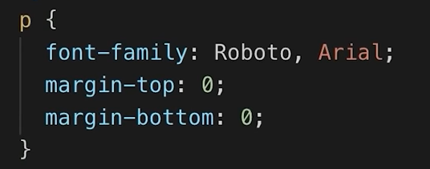
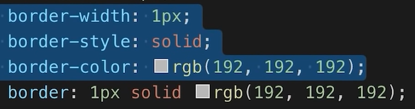

漫长又炎热的暑假我开始了我的前端学习之路。

<!--more-->

- [1.Created element with HTML](#1created-element-with-html)
- [2.Style with CSS one by one](#2style-with-css-one-by-one)
  - [常用的样式（自行查阅MDN文档）](#常用的样式自行查阅mdn文档)
  - [display](#display)
    - [flex](#flex)
  - [position](#position)
  - [responsive design](#responsive-design)
  - [CSS Shorthand Properties](#css-shorthand-properties)
  - [Inheritance](#inheritance)
  - [CSS Specificity](#css-specificity)
  - [semantic element](#semantic-element)
  - [注释](#注释)
- [Always remerber to Google if forget](#always-remerber-to-google-if-forget)


核心要素是下面两点

# 1.Created element with HTML

# 2.Style with CSS one by one

> 格式缩进为2字符，VScode可修改默认tab为2个空格

## 常用的样式（自行查阅MDN文档）

box-shadow 为设置阴影，x,y,z,m 

x 和 y 表示 偏移x方向和偏移y方向（向右向下为正方向）  rgba设置阴影颜色 

opacity 不透明 可让hover 和 active 平滑过渡
cusor设置为光标变化
transition 参数为 属性及过渡时间

元素外的间距 margin
元素内间距 padding
元素本身 height width 

## display

block element: 块状元素占满整行  **in their container**

inline element 内联元素

inline-block element : 占据需要的空间


强烈推荐这个小游戏，对于学习flex box和grid很有帮助(https://codingfantasy.com/games)  
### flex
`justify-content`
> Reminder: justify-content defines how the browser distributes space between and around items horizontally.

简单的理解就是用于水平方向空间分配的调整，注意是相对你的对齐方式而言。

取值: center   
flex-start   
flex-end   
space-between   
space-around   
space-evenly  

`align-items`
> Reminder: align-items defines how the browser distributes space between and around items vertically.

简单的理解就是用于垂直方向空间分配的调整，注意是相对你的对齐方式而言。
取值： center   
flex-start   
flex-end   
baseline   
stretch  

`flex-direction`
> 属性指定了内部元素是如何在 flex 容器中布局的，定义了主轴的方向 (正方向或反方向)。

简单的理解就是对齐的方向

取值: row row-reverse column column-reverse

`order`
> The order property specifies the order of a flexible item relative to the rest of the flexible items inside the same container. By default, items have a value of 0. But we can set any positive or negative integer value.

字面意思，order决定顺序，元素默认的order是0，将按order升序排列。

`aligh-self`
> align-self 会对齐当前 grid 或 flex 行中的元素，并覆盖已有的 align-items 的值。In Grid, it aligns the item inside the grid area. 在 Flexbox 中，会按照 cross axis（当前 flex 元素排列方向的垂直方向）进行排列。


`flex-wrap`
> flex-wrap 属性指定 flex 元素单行显示还是多行显示。如果允许换行，这个属性允许你控制行的堆叠方向。

取值：nowrap (默认值)
wrap 
wrap-reverse

`align-content`
> align-content 属性设置了浏览器如何沿着弹性盒子布局的纵轴和网格布局的主轴在内容项之间和周围分配空间。

取值： flex-start
center
space-between
space-around


 <div>  can contain other elements
> div = contains  , a  box

Nested Layouts Technique
1. Vertical Layout
2. Horizontal Layout




摆脱margin默认值


flex-shrink: 0; = don't shrink

width: 0; = shrink


## position

fixed = placed in the browser window

absolute = place on the page

对布局进行微调的时候可少量使用relative和absolute  
这两者必须同时出现才有效  
给上级标签一个position: relative 属性相当于以这个标签为起始建立了一个坐标轴  
给下级标签一个position: absolute 属性，然后用top、bottom、left、right 这四个属性加上px像素，就是该标签相对上级坐标轴的上下左右距离

## responsive design

```css
@media (max-width: 600px) {
}

@media (min-width: 601px) and (max-width: 999px) {
    
}
```


## CSS Shorthand Properties

```css
padding-left: 4px;
padding-right: 4px;
padding-top: 4px;
padding-bottom: 4px;

-->

padding: 4px; 

-->

padding: 4px, 4px;

first value -- vertical padding 
second value -- horizontal padding
```



## Inheritance

text properties like text decoration underline color font weight and font family 

it doesn't affect things like border padding or margin 

certain properties **mostly text properties** will get passed down from the outer element to rhe inner elements 

css follows a sort of priority

##  CSS Specificity

details on CSS Specificity in the [HTML & CSS Referance](https://supersimple.dev/html)

## semantic element 

= same as <div>

have meaning to screen readers

```
<header> </header>
<nav> </nav>
<main> </main>
<section> </section>
```

## 注释

```
<!-- Comments in HTML--> 
/* Comments in CSS*/
```

# Always remerber to Google if forget

thank you!
