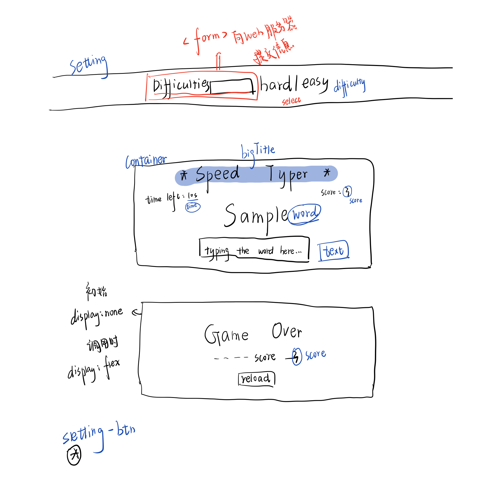

实践是检验真理的唯一标准。

写这篇日志的时候进度已经过半，养成良好习惯，补回这篇文档。😆😆😆

<!--more-->


## 游戏效果
[点击开始游戏](https://aqpower.cn/typing-game/)

## 设计图

  

## 更新进度

### 8.28

#### ①试图解决暂停功能只能使用一次的问题

> 之前加入了暂停功能，但是经过测试只能使用一次，而且第二次使用会导致时间减少的更快。
> 初步把问题定位在计时器没有被正确删除，打算使用控制台输出日志方式调试解决问题

```Javascript
let isStop = 0;
stopBtn.addEventListener('click', () => {
  if (isStop === 1) {
    let timeInterval = setInterval(updateTime, 1000);
    isStop = false;
  } else {
    clearInterval(timeInterval);
    text.value = '';
    isStop = 1;
  }
})

```
#### ②计划加入开始游戏按键
> 一加载完界面直接进入游戏有点不人性了，故增加开始游戏按键！

#### ③优化了菜单内容和整体布局
增加了文字说明，本来只有很简单的图标提示功能，但是在加入了开始游戏按键后过于眼花缭乱故加入了文字。

### 8.29

#### ①继续优化时间控制功能
把所有和定时器有关的代码集成到了同一个函数里面，更直观，优化了代码逻辑。

#### ②修复了未点击开始游戏就显示单词的bug
> 如果你不点击开始就有单词的话，那岂不是可以先准备好一手，不太合理。
同时对提示文本做出了相应改动。
#### ③对暂停游戏按钮做了点击前后文本内容不一样的处理。


## `遇到的大问题：每次使用clearInterval后我的计时器没有暂停啊！！！！！`  
为什么啊！明明使用了clearInterval后我的time还是在不断地减少，丝毫没有停的迹象？  
😠😰😭😱😇😇😇💔🥀🥀  
网上查找一番后发现这是一个好多同学都遇到的问题？还是去MDN查看官方文档吧...
>[参考文章 [1]使用setInterval与clearInterval踩的小坑总结](https://juejin.cn/post/6844903576267915278)  
[参考文章 [2]JS设置定时器和清除定时器](https://www.cnblogs.com/chenyoumei/p/12695381.html)  
> 
> 每次执行setInterval都会生成一个唯一的intervalId, 只是每次生成id之后都赋值给了同一个变量, 因此这个变量的值永远都是最后一次生成的id, 而我们使用clearInterval做清除操作的时候, 传入变量, 自然清除的也是最后一个interval, 而之前的interval一直在执行, 只是没有变量接收它们返回的intervalId, 因此也没法被取消

## Bug解决了！！！！！！！
```Javascript
// 专门改变时间                       
let timeControl = false;
let timeInterval = 0;     //和之前的代码不同的是我做出了这个调整
function timeControlFunction() {
  if (timeControl === false) {
    console.log("function to start time");
    if(timeInterval){
      clearInterval(timeInterval);
    }
    timeInterval = setInterval(updateTime, 1000);
    timeControl = true;
  } else {
    console.log("function to stop time");
    clearInterval(timeInterval);
    timeInterval = 0;
    timeControl = false;
  }
}
```
#### ⑤增加再来一局按钮
并相应完成了对应Js内容编写，采取的方法是直接刷新页面。

#### ⑥把菜单部分的html内容进行了整合修改
因为随着优化的不断进行，按钮变得越来越多，在css上一个一个增加显然非常麻烦。  
于是把所有的按钮放在了一个div盒子里面，使用flex布局即可。  
我早该如此的。  
css代码量大量减少

## 思考
目前的效果是是在未开始游戏点击“暂停游戏”按钮和“再来一局”按钮没有设置任何反馈，感觉不太好，但是感觉提示还未开始游戏有点突兀，识图寻找更好的解决方式。

### 有了！那两个按钮只能在开始游戏后显示不久好了！！！！！
这样在未开始游戏的时候根本就不能点击到相应的按钮，就没有问题了。

> 遇到问题了,因为我之前的 _优化_ 把按钮整合到一起,这样的CSS优先级非常高,我后面设置display:none 时使用!important,而js不能简单的修改带!important的css样式

`用js修改带!important的css样式`
解决办法: [用js修改带!important的css样式](https://blog.51cto.com/u_15127659/4325201)

大功告成!