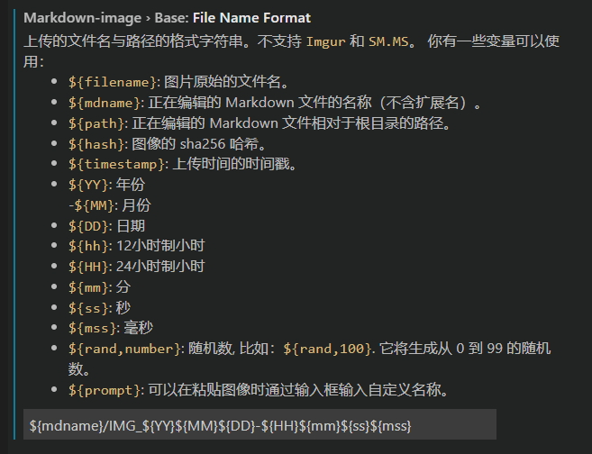
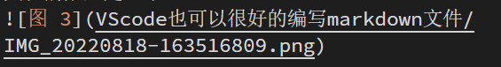
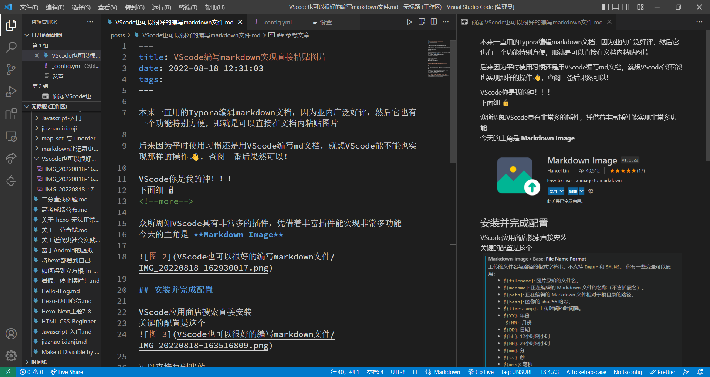

本来一直用的Typora编辑markdown文档，因为业内广泛好评，然后它也有一个功能特别方便，那就是可以直接在文档内粘贴图片  

后来因为平时使用习惯还是用VScode编写md文档，就想VScode能不能也实现那样的操作👋，查阅一番后果然可以！  

VScode你是我的神！！！  
下面细 🔒
<!--more-->

众所周知VScode具有非常多的插件，凭借着丰富插件能实现非常多功能  
今天的主角是 **Markdown Image**

  

## 安装并完成配置

VScode应用商店搜索直接安装  
关键的配置是这个

可以直接复制我的

`${mdname}/IMG_${YY}${MM}${DD}-${HH}${mm}${ss}${mss}`

功能就是在粘贴图片的同时把图片存放到md目录下与mdname命名的文件夹内。

这不巧了，hexo支持在hexo new一篇新文档是自动创建同名文件夹的功能，相辅相成，去_config.yml将**post_asset_folder**设置为true即可。

之后就可以美滋滋的使用VScode在md文件内直接粘贴图片啦👏~

  

最后整个编辑界面看起来是这样的，非常符合本人审美，使用起来非常舒服。

  

## 参考文章
[[1] 将 VS Code 打造成一个体验舒适的 Markdown 编辑器](https://blog.bugimg.com/works/vscode-to-markdown-editor.html#%E8%BD%AF%E4%BB%B6%E5%AE%89%E8%A3%85)
